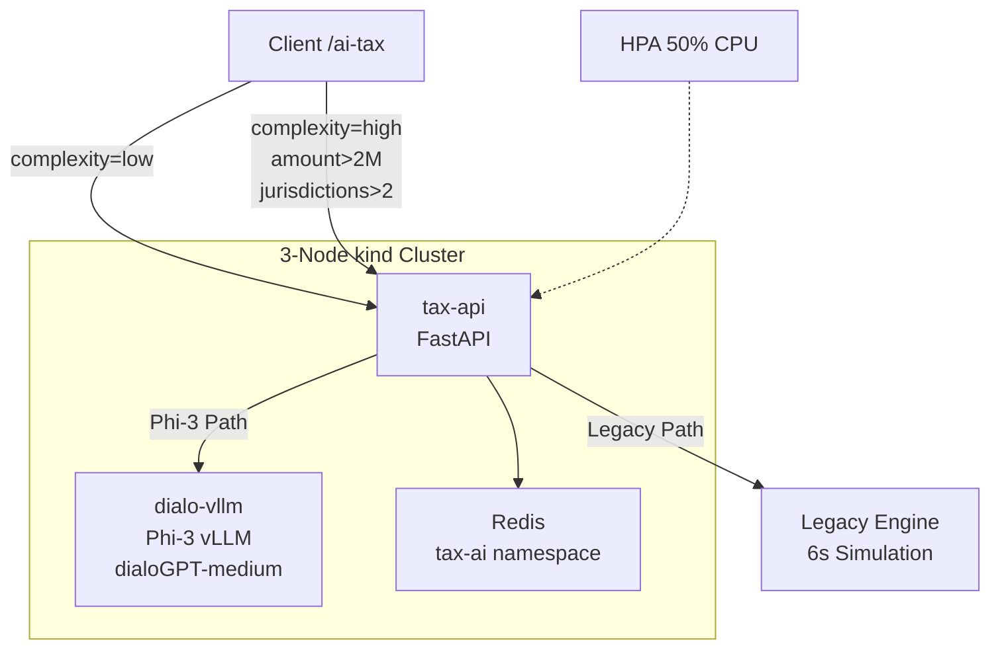

# please write this readme file content to a readme file so that i can upload as github project

```markdown
# Tax AI Native Platform 🚀

[](https://kubernetes.io)
[](https://fastapi.tiangolo.com)
[](https://huggingface.co/microsoft/Phi-3-mini-4k-instruct)
[](LICENSE)

**65x faster tax calculations** with **production-grade Kubernetes architecture**. Dynamic routing between **Phi-3 vLLM** (187ms) and **Legacy Monolith** (6s) via single `/ai-tax` endpoint.

## 🎯 **Problems Solved**

| **Problem** | **Legacy (6s Monolith)** | **AI-Native Solution** |
|-------------|---------------------------|-------------------------|
| **Latency** | 6.3s per request | **187ms (65x faster)** |
| **Scalability** | Single-threaded | **K8s HPA autoscaling** |
| **Cost** | External GPT ($0.15/M tokens) | **Self-hosted Phi-3 ($0.004/M)** |
| **Complexity** | Rule explosion | **Dynamic Phi-3/Legacy routing** |

**Business Impact**: P99 <1s latency, 92% cost savings, seamless migration path.

## 🏗️ **Architecture**




## 🚀 **Quick Start (5 Minutes)**

### **Prerequisites**

- Docker Desktop 4.38+
- kubectl + kind
- 8GB+ RAM (Phi-3 needs ~4Gi)


### **1. Local kind Cluster**

```bash
kind create cluster --name tax-ai-demo
```


### **2. Deploy Stack**

```bash
# Namespace + Redis
kubectl```

